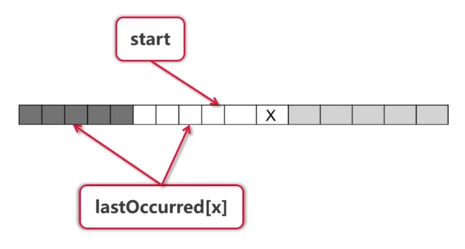
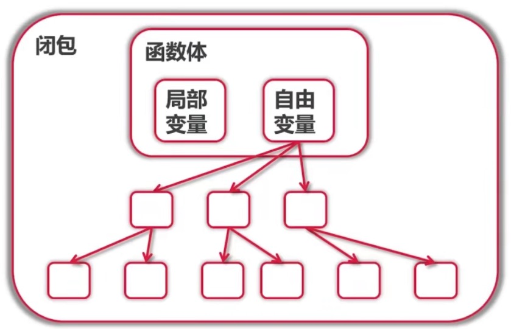

# golang学习记录
## 寻找最长不含有重复字符的子串

**对于每一个字符**
* lastOccurred[x]不存在,或者 < start --> 无需操作
* lastOccurred[x] >= start --> 更新start
* 更新lastOccurred[x], 更新maxLength
## 基础
### 封装
* 名字一般使用CamelCase
* 首字母大写: public
* 首字母小写: private
### 包
* 为结构定义的方法必须放在同一个包内
* 可以是不同的文件
* 如何扩充系统类型或者别人的类型
    * 定义别名
    * 使用组合
### GOPATH环境变量
* 默认在~/go(unix, linux), %USERPROFILE%\go(windows)
* 官方推荐: 所有项目和第三方库都放在同一个GOPATH下
* 也可以将每个项目放在不同的GOPATH
### go get获取第三方库
* go get 命令
* 使用gopm来获取无法下载的包
### 接口
* 接口由使用者定义
* 接口实现是隐式的
* 接口变量里面有什么:
    * 接口变量自带指针
    * 接口变量同样采用值传递, 几乎不需要使用接口的指针
    * 指针接收者实现只能以指针的方式使用; 值接收者都可以
* 查看接口变量:
    * 表示任何类型: interface{}
    * Type Assertion
    * Type Switch
### 函数式编程
* 函数是一等公民: 参数,变量,返回值都可以是函数
* 高阶函数
* 函数 -> 闭包

### 资源管理
* defer调用确保在函数结束时调用
* 参数在defer语句时计算
* defer列表为先进后出
* 何时使用defer: 
    * Open/Close
    * Lock/Unlock
    * printHeader/printFooter
### goroutine
* 协程 Coroutine
    * 轻量级的"线程"
    * **非抢占式**多任务处理, 由协程主动交出控制权
    * 编译器/解释器/虚拟机层面的多任务
    * 多个协会才能可以在一个或多个线程上运行
* goroutine的定义:
    * 任何函数只需要加上go就能送给调度器运行
    * 不需要在调度时进行区分是否是异步函数
    * 调度器在合适的点进行切换
    * 使用-race来检测数据访问的冲突
* goroutine可能切换的点:
    * I/O,select
    * channel
    * 等待锁
    * 函数调用(有时)
    * runtime.Gosched()